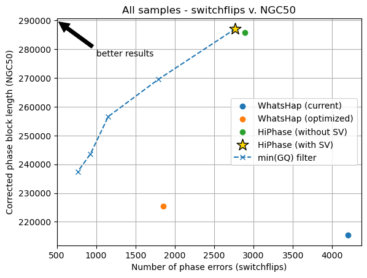
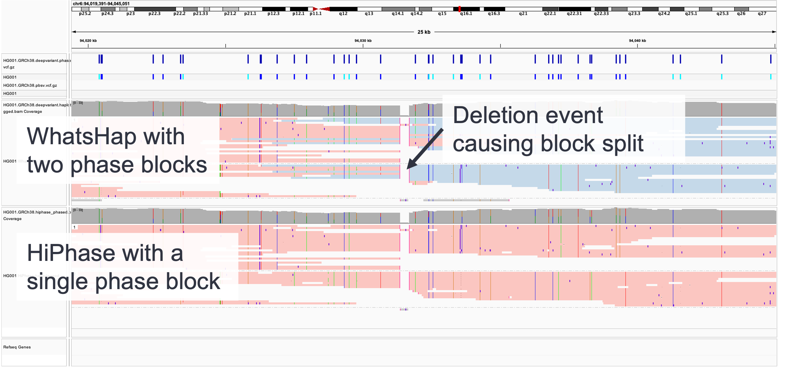
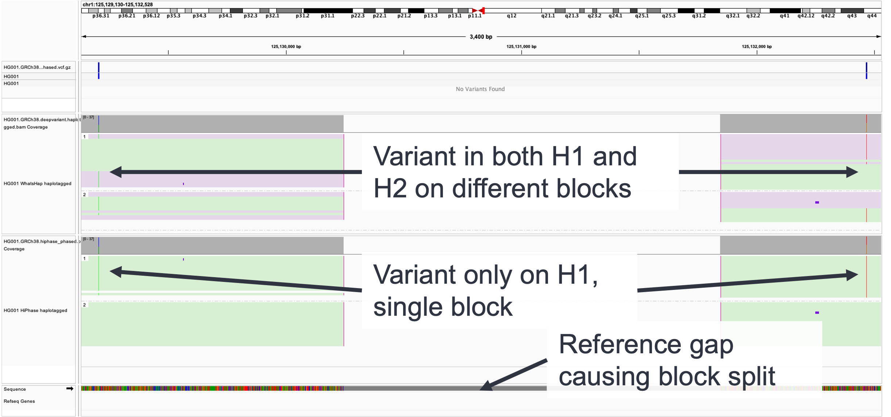

# Performance
Table of Contents:
* [Summary results](#results)
* [Tool definitions](#tool-definitions)
* [HiPhase IGV examples](#hiphase-igv-examples)

# Results
All data below is based on three Genome in a Bottle (GIAB) samples that were sequenced internally on the Sequel II platform: HG001, HG002, and HG005.
Each sample was sequenced to approximately 30x coverage.
All reads were aligned using pbmm2 and variants were called with DeepVariant and pbsv.
Comparator truth sets were collected from [NCBI](https://ftp-trace.ncbi.nlm.nih.gov/ReferenceSamples/giab/release/) using the NIST v4.2.1 release files.
Finally, `whatshap compare` was used to assess phasing accuracy.

## Summary figure
The following figure shows the overall phasing results of HiPhase against comparator tools.
In short, HiPhase (both with and without SV) reduces the number of phase errors (switchflips) relative to our current approach while drastically improving corrected phase block length (NGC50).
Additionally, the GQ filter can be used on the provided variants to enable users to trade phase block length for reduced errors.

## Summary table
Where appropriate, the best results are **bolded** below.

| Metric | WhatsHap (current) | WhatsHap (optimized) | HiPhase (without SV) | HiPhase (with SV) |
| -- | -- | -- | -- | -- |
| NG50 (mean) | 248,730 | 238,626 | 310,547 | **312,620** |
| Switchflips (sum) | 4,196 | **1,856** | 2,888 | 2,768 |
| NGC50 (mean) | 215,392 | 225,435 | 285,874 | **287,129** |
| Hamming distance (sum) | 110,379 | **71,497** | 122,866 | 125,239 |
| Phased variants (sum, DV / pbsv) | **8,608,868** / 0 | 8,467,279 / 0 | 8,508,485 / 0 | 8,475,329 / **69,290** |
| Genes fully phased (mean) | 68.35% | 67.65% | 71.78% | **71.89%** |
| Wall clock time* | 5,580 (1.5 hrs) | 7,403 (2.1 hrs) | **5,461 (1.5 hrs)** | 12,178 (3.4 hrs) |

Some caveats to remember when reviewing this table:
* "WhatsHap (current)" _forces_ all heterozygous variants into a phase, so its "Phased variants" count is the number of heterozygous variants across the three datasets
* "HiPhase (with SV)" is the only comparator here that phases SVs with the small variants, all others will have 0 phased SVs by design
* "Hamming distance" measures the severity of errors and tends to increase with block lengths. Tools with higher NG50s will tend to have a higher hamming distance when they do make an error.
* "Genes fully phased" is based on raw blocks, not corrected blocks
* "Wall clock time*" is measured differently due to differences in execution, see notes on metrics below

## Accuracy metric definitions
The following describe the main metrics we use to assess phasing accuracy.
For HiPhase development, we primarily focused on reducing **switchflips** (phasing errors) and increasing **NGC50** (correct phasing stretches).

* Phase block NG50 - a length such that all phase blocks of size greater than or equal to this length cover at least 50% of the reference genome
* **Switchflips** - errors in phasing when compared to some benchmark or "truth" set; switchflips capture two error types: switches and flips
  * Switch - when two consecutive (or adjacent) heterozygous variants are incorrectly phased; all variants upstream/downstream of the switch are incorrectly phased with each other
  * Flip - two back-to-back switch errors, such that only the single variant in between them is incorrectly phased; while a flip counts as two switch errors, it is less severe of a error with respect to hamming distance
  * For more details on either, see [whatshap compare](https://whatshap.readthedocs.io/en/latest/guide.html#whatshap-compare)
* **Phase block NGC50** (or "Corrected NG50") - a modified version of NG50 that accounts for switchflip errors; it is calculated by splitting and truncating raw phase blocks wherever a switchflip error is detected, leaving only fully correct blocks (according to the comparator); then NG50 is recalculated using just these corrected blocks
  * NGC50 is always <= NG50
  * NGC50 is useful for measuring stretches of _correct_ phasing, as opposed to just the raw length of a block
* Hamming distance - a measure of the severity of switchflip errors; for a single block, hamming distance is the smallest number of variants that are incorrectly phased in the block (see [whatshap compare](https://whatshap.readthedocs.io/en/latest/guide.html#whatshap-compare))
  * One switch error can lead to drastically different hamming distance measures
  * One flip error (absent other factors) will always create a hamming distance = 1 for a block
  * Longer blocks tend to create larger hamming distances if an error occurs, making the metric less suitable for measuring phase error but more suitable for understanding the severity of errors made
* Phased variants - the number of heterozygous variants that are phased in the output VCFs (i.e. they have a "|" in the genotype/GT field)
* Genes fully phased - the percentage of annotated genes that were fully covered by a single phase block
* Wall clock time* - In all instances, these were run on cluster compute and are subject all measurement nuances that come with that. We made an effort to reduce variability in these measurements when possible.
  * WhatsHap is single threaded, but can be parallelized by running multiple cluster jobs where each job handles on chromosome. We took the longest running of these parallel jobs as representative of the wall clock time.
  * HiPhase has built-in multi-threading and was given 16 threads per job. Additionally, HiPhase does not downsample the data (as is the case with WhatsHap), so this cost represents the cost to process the full breath of data available.

# Tool definitions
Unless otherwise specified, all tools used the appropriate options to ingest the same collection of BAM and VCF file inputs.
This was typically multiple pbmm2-aligned BAM files (one per HiFi CCS movie) and one VCF file containing small variant calls from DeepVariant.
HiPhase (with SV) additionally used a VCF call file from pbsv that contained structural variants.
Additionally, all tools were given the reference FASTA file using the corresponding option.

## HiPhase (without SV)
This mode only phases small variant calls is the most direct comparator to other approaches that do not use structural variant calls.
This is the recommended mode for HiPhase if only small variant calls are provided.

* Version - v0.7.1
* Extra parameters - None

## HiPhase (with SV)
This mode phases both small variants and structural variants at the same time.
The extra parameter below enables global re-alignment (see [Methods](./methods.md)) with a 5 minute CPU timeout.
This is the recommended approach for phasing both small and structural variants at the same time.

* Version - v0.7.1
* Extra parameters - `--global-realignment-cputime 300`

## HiPhase with min(GQ) filter
This line shows the performance of "HiPhase (with SV)" as you increased the minimum variant GQ value from 0 to 20 with increments of 5.

* Version - v0.7.1
* Extra parameters - Everything in HiPhase (with SV) plus `--min-vcf-qual {GQ}`

## WhatsHap (current)
[WhatsHap](https://whatshap.readthedocs.io/en/latest/index.html) is the main comparator we used for measuring the relative performance of HiPhase.
WhatsHap used read-based phasing and works quite well on most small variants (e.g. SNVs, indels).
It does have some limitations, but it is the _de facto_ standard when it comes to long-read phasing of human datasets.

This first mode of WhatHap is the typical mode we expect most users default to, and it is what we used historically for phasing HiFi datasets.
In this mode, the reference genome is provided to improve local re-alignment and indel phasing is enabled as well.
Relative to SNV-only, this mode has longer phase blocks but also more errors.

* Version - v1.4
* Extra parameters: `--indel`

## WhatsHap (optimized)
In internal testing, we found one option that improved the phasing results in terms of errors and NGC50.
The `--distrust-genotypes` option allows WhatsHap to convert heterozygous variants to homozygous if that leads to a more optimal solution.
In general, this reduces the number of errors and improves NGC50.
However, this method does convert the variant to its homozygous representation in the output file (as opposed to leaving it as an unphased heterozygous call), which may be undesirable for downstream applications.

* Version - v1.4
* Extra parameters: `--indel --distrust-genotypes`

# HiPhase IGV Examples
The main purpose of this section to show examples of regions that are challenging to generate phase blocks for.
In each example, we have the comparator BAM (WhatsHap) on top with the HiPhase solution on the bottom.
Unless otherwise specified, reads are grouped by haplotype tag (HP) and colored by phase block ID (PS).

## Spanning homozygous deletions
This example shows a typical scenario where a homozygous deletion causes a phase block split.
The deletion event (center of image) leads to a loss of individual read mappings that span the coverage gap.
In the top half of the figure, WhatsHap cannot find mappings that span the gap, leading to two different blocks upstream and downstream of the deletion (red and blue colors, respectively).
Additionally, variants near the deletion gap are assigned to both haplotypes, depending on which phase block the read mapping was assigned to.

HiPhase leverages the information found the supplemental mappings to recognize that this gap can be spanned with the available data.
In the bottom figure, a single phase block (red) spans the entire region.
Additionally, variants near the deletion gap are cleanly assigned to a single haplotype (H1 or H2).

## Spanning reference gaps
This example shows a similar scenario, but this gap is caused by a gap in the underlying reference genome (e.g. it is all "N" characters).
Again, WhatsHap does not identify any mappings spanning the gap, so separate blocks are generate for upstream and downstream (green and purple, respectively).
Additionally, the two variants closest to the gap show up in different haplotypes depending on which phase block the read mapping was assigned to.

HiPhase generates a single block (green) spanning this gap, and correctly phases the two variants onto the same haplotype (H1 in this example).

